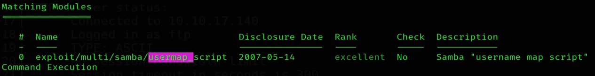

# Lame


## Author
**ch4p**

## Task

> Find user.txt and root.txt file in the victim’s machine.

## Solution

First thing first, nmap:

`nmap -sV -sC -oA NmapScan -v 10.10.10.3`

The results of this scan will be the only thing we need!

```bash
Nmap scan report for 10.10.10.3
Host is up (0.038s latency).
Not shown: 996 filtered tcp ports (no-response)
PORT    STATE SERVICE     VERSION
21/tcp  open  ftp         vsftpd 2.3.4
| ftp-syst: 
|   STAT: 
| FTP server status:
|      Connected to 10.10.14.6
|      Logged in as ftp
|      TYPE: ASCII
|      No session bandwidth limit
|      Session timeout in seconds is 300
|      Control connection is plain text
|      Data connections will be plain text
|      vsFTPd 2.3.4 - secure, fast, stable
|_End of status
|_ftp-anon: Anonymous FTP login allowed (FTP code 230)
22/tcp  open  ssh         OpenSSH 4.7p1 Debian 8ubuntu1 (protocol 2.0)
| ssh-hostkey: 
|   1024 600fcfe1c05f6a74d69024fac4d56ccd (DSA)
|_  2048 5656240f211ddea72bae61b1243de8f3 (RSA)
139/tcp open  netbios-ssn Samba smbd 3.X - 4.X (workgroup: WORKGROUP)
445/tcp open  netbios-ssn Samba smbd 3.0.20-Debian (workgroup: WORKGROUP)
Service Info: OSs: Unix, Linux; CPE: cpe:/o:linux:linux_kernel

Host script results:
| smb-security-mode: 
|   account_used: guest
|   authentication_level: user
|   challenge_response: supported
|_  message_signing: disabled (dangerous, but default)
| smb-os-discovery: 
|   OS: Unix (Samba 3.0.20-Debian)
|   Computer name: lame
|   NetBIOS computer name: 
|   Domain name: hackthebox.gr
|   FQDN: lame.hackthebox.gr
|_  System time: 2023-10-10T17:41:37-04:00
|_clock-skew: mean: 2h00m20s, deviation: 2h49m43s, median: 19s
|_smb2-time: Protocol negotiation failed (SMB2)

Read data files from: /usr/bin/../share/nmap
Service detection performed. Please report any incorrect results at https://nmap.org/submit/ .
```
We see some `vsftpd  v2.3.4` with anonymous access and also some informations reguarding the `Samba v3.0.20` service. 

I first tried to access the ftp service with anonymous credentials (user : `anonymous`, psw : `anonymous`) but nothing was there.

Then I searched for an *ftp v2.3.4* exploit using Metasploit and found a *Backdoor Command Execution*, it didn't work for some reason.

Finally there was a vulnerability in that Samba v3.0.20, a *username map script Command Execution* that worked! 

In Metasploit it's under:



Changing the `RHOST` to the ip of the machine and the `LHOST` to the ip of the *tun0* interface (because of the connection through the vpn) we'll successfully obtain a shell.

Let's verify if Python exists on the system:

`which python`

Python is there, let's make a quick and simple TTY with the command:

`shell`

and rom here we just navigate a little bit to find both the user flag (`/home/makis`) and the root flag (`root`) available! 